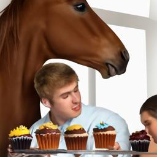
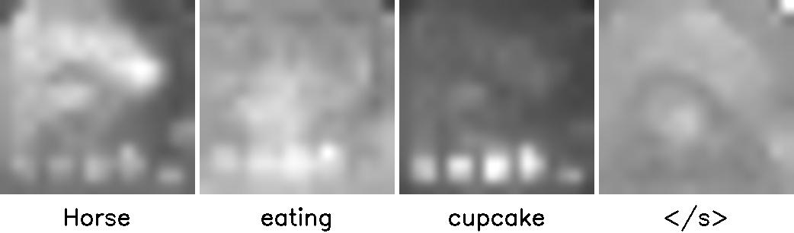
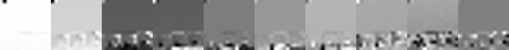

Adapted code from [Prompt-to-Prompt](https://github.com/google/prompt-to-prompt) to support [DeepFloyd IF](https://github.com/deep-floyd/IF).

## Instructions

```
python prompt-to-prompt_deepfloyd.py
```

## Results

Stage I:


Stage II:



Cross-attention from Stage I:



Self-attention from Stage II:



## Credits

```
@article{mokady2022null,
  title={Null-text Inversion for Editing Real Images using Guided Diffusion Models},
  author={Mokady, Ron and Hertz, Amir and Aberman, Kfir and Pritch, Yael and Cohen-Or, Daniel},
  journal={arXiv preprint arXiv:2211.09794},
  year={2022}
}

```
